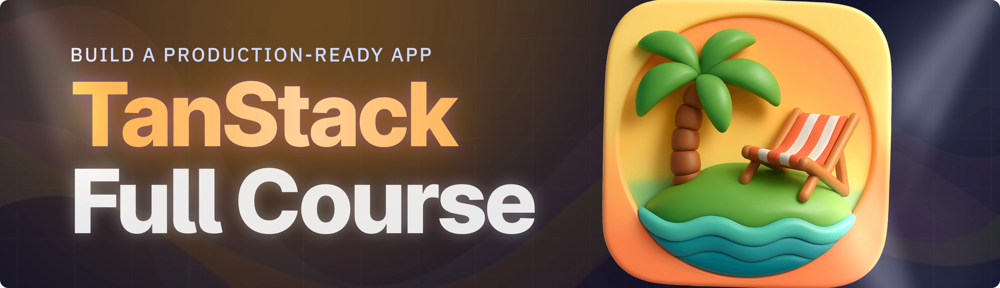

<div align="center">
  <br />
    <a href="" target="_blank">
      
    </a>
  <br />

  <div>


<br/>


  </div>

  <h3 align="center">Agent Skill Sharing Platform</h3>

   <div align="center">
     Build this project step by step with our detailed tutorial on <a href="https://www.youtube.com/watch?v=XUkNR-JfHwo" target="_blank"><b>JavaScript Mastery</b></a> YouTube. Join the JSM family!
    </div>
</div>

## 📋 <a name="table">Table of Contents</a>

1. ✨ [Introduction](#introduction)
2. ⚙️ [Tech Stack](#tech-stack)
3. 🔋 [Features](#features)
4. 🤸 [Quick Start](#quick-start)
5. 🔗 [Assets](#links)
6. 🚀 [More](#more)

## 🚨 Tutorial

This repository contains the code corresponding to an in-depth tutorial available on our YouTube channel, <a href="https://www.youtube.com/@javascriptmastery/videos" target="_blank"><b>JavaScript Mastery</b></a>.

If you prefer visual learning, this is the perfect resource for you. Follow our tutorial to learn how to build projects like these step-by-step in a beginner-friendly manner!

<a href="" target="_blank"></a>

## <a name="introduction">✨ Introduction</a>

Agent Skill Sharing is a fullstack platform for discovering and sharing AI Agent capabilities, built on the TanStack Start framework. The application utilizes TailwindCSS for responsive UIs and TypeScript for end-to-end type safety across complex nested routes. It integrates Clerk for authentication, Firebase for real-time data and community upvotes, and custom Middlewares for request validation. Product analytics are handled by PostHog, while CodeRabbit automates senior-level code reviews to maintain a professional codebase.

If you're getting started and need assistance or face any bugs, join our active Discord community with over **50k+** members. It's a place where people help each other out.

<a href="https://discord.com/invite/n6EdbFJ" target="_blank"></a>

## <a name="tech-stack">⚙️ Tech Stack</a>

- **[TanStack Start](https://tanstack.com/start/latest)** is a full-stack React framework that provides type-safe routing, data fetching, and server-side rendering. It enables the creation of complex, nested shared routing architectures while maintaining end-to-end type safety.

- **[TailwindCSS](https://tailwindcss.com/)** is a utility-first CSS framework used to build slick, responsive user interfaces. It allows for rapid styling directly in your markup, ensuring a consistent design system and optimized bundle sizes.

- **[TypeScript](https://www.typescriptlang.org/)** is a strongly typed superset of JavaScript used to validate server requests, protect secure routes via middleware, and ensure code reliability across the entire application stack.

- **[Clerk](https://jsm.dev/tanstack-clerk)** is a comprehensive authentication and user management platform. It provides secure components and hooks for handling sign-ins and session management, allowing for seamless integration of protected routes.

- **[Firebase](https://firebase.google.com/)** is a backend-as-a-service platform that handles live database reads, writes, and real-time synchronization. It serves as the data layer for managing community upvotes and dynamic content updates.

- **[PostHog](https://jsm.dev/tanstack-posthog)** is an industry-standard product analytics suite used to track user interactions. It allows you to monitor exactly what users are clicking and watching, providing actionable insights into application usage.

- **[CodeRabbit](https://jsm.dev/tanstack-coderabbit)** is an AI-powered code review platform that automates feedback for pull requests. It acts as a senior developer in your workflow, identifying bugs and suggesting optimizations to maintain high-quality code.

## <a name="features">🔋 Features</a>

👉 **Responsive UI**: A slick, modern interface built with TailwindCSS, ensuring a seamless experience across all device sizes with high-performance styling.

👉 **Nested Routing**: A sophisticated navigation architecture powered by TanStack Start, implementing complex shared layouts and deeply nested routes for a professional app structure.

👉 **Secure Authentication**: Robust user signup and login systems integrated via Clerk, featuring secure session management and protected user profiles.

👉 **Live Database**: Real-time data handling using Firebase for instant reads and writes, enabling live community upvotes and dynamic content synchronization.

👉 **Route Protection**: Advanced server-side security using custom Middlewares to validate incoming requests and safeguard sensitive application routes.

👉 **User Analytics**: Professional-grade monitoring via PostHog to track user behavior, clicks, and engagement patterns with industry-standard analytics tools.

👉 **AI Code Reviews**: Automated, senior-level code analysis using CodeRabbit to maintain high quality, catch bugs early, and optimize your feature implementation.

And many more, including code architecture and reusability.

## <a name="quick-start">🤸 Quick Start</a>

Follow these steps to set up the project locally on your machine.

**Prerequisites**

Make sure you have the following installed on your machine:

- [Git](https://git-scm.com/)
- [Node.js](https://nodejs.org/en)
- [npm](https://www.npmjs.com/) (Node Package Manager)

**Cloning the Repository**

```bash
git clone https://github.com/adrianhajdin/skild.git
cd skild
```

**Installation**

Install the project dependencies using npm:

```bash
npm install
```

**Set Up Environment Variables**

Create a new file named `.env` in the root of your project and add the following content:

```env
VITE_CLERK_PUBLISHABLE_KEY=
CLERK_PUBLISHABLE_KEY=
CLERK_SECRET_KEY=


VITE_FIREBASE_AUTH_DOMAIN=
VITE_FIREBASE_PROJECT_ID=
VITE_FIREBASE_APP_ID=
VITE_FIREBASE_API_KEY=

FIREBASE_PRIVATE_KEY_ID=
FIREBASE_PRIVATE_KEY=
FIREBASE_CLIENT_EMAIL=
FIREBASE_CLIENT_ID=
```

Replace the placeholder values with your real credentials. You can get these by signing up at: [**Clerk**](https://jsm.dev/tanstack-clerk), ou can get these by signing up at: [**PostHog**](https://jsm.dev/tanstack-posthog), [**Firebase**](https://console.firebase.google.com/).

**Running the Project**

```bash
npm run dev
```

Open [http://localhost:3000](http://localhost:3000) in your browser to view the project.

## <a name="links">🔗 Assets</a>

Assets and snippets used in the project can be found in the **[video kit](https://jsmastery.com/video-kit/f0586ae7-511e-4891-a252-b674519f2d5e)**.

<a href="https://jsmastery.com/video-kit/f0586ae7-511e-4891-a252-b674519f2d5e" target="_blank">
  
</a>

## <a name="more">🚀 More</a>

**Advance your skills with Next.js Pro Course**

Enjoyed creating this project? Dive deeper into our PRO courses for a richer learning adventure. They're packed with
detailed explanations, cool features, and exercises to boost your skills. Give it a go!

<a href="https://jsm.dev/tanstack-jsm" target="_blank">
  
</a>
